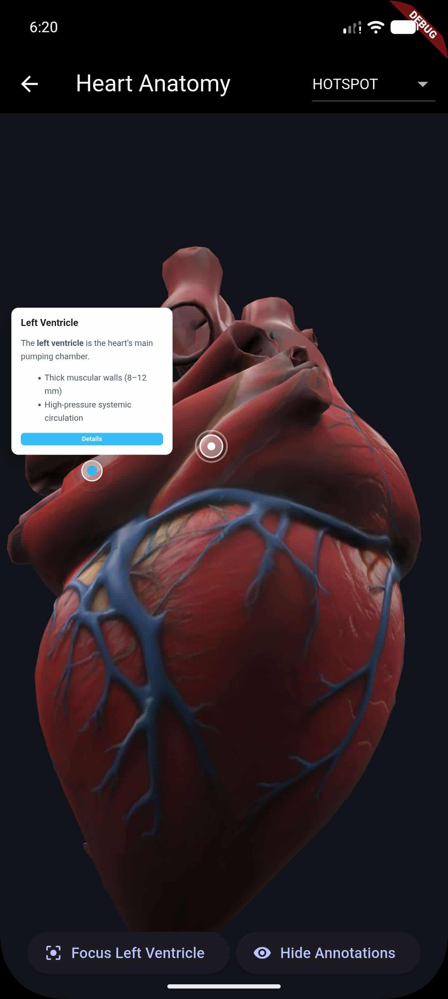
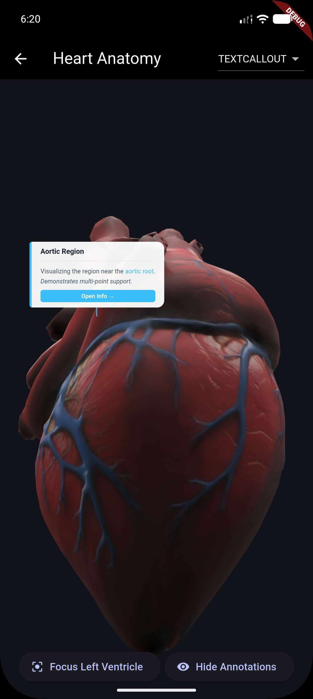

# Power3D Annotations

[](https://pub.dev/packages/power3d_annotations)
[](https://dart.dev)
[](https://opensource.org/licenses/MIT)

A modular companion package for [Power3D](https://pub.dev/packages/power3d) that provides high-quality, interactive annotation styles.

[**pub.dev**](https://pub.dev/packages/power3d_annotations) | [**Repository**](https://github.com/rashbip/power3d_annotations)

## 📸 Showcase

| **Hotspot Style** | **Text Callout Style** |
| :---: | :---: |
|  |  |
| _Minimalist Markers_ | _Interactive HTML Callouts_ |

## 📦 Included Styles

-   **Hotspot**: Minimalist circular markers that reveal a detail card on click. Perfect for clean product showcases.
-   **TextCallout**: Floating titles that expand into rich HTML descriptions when interacted with.

## 🚀 Getting Started

### 1. Add Dependencies

Add both the core engine and the annotations package to your `pubspec.yaml`:

```yaml
dependencies:
  power3d: ^2.2.0
  power3d_annotations: ^1.0.0
```

### 2. Initialize the Controller

To support Enums and automatic style loading, initialize your controller for annotations:

```dart
final controller = Power3DController()..initForAnnotations();
```

### 3. Use in the Widget

Pass the style enum directly to the `Power3D` viewer:

```dart
Power3D.fromAsset(
  'assets/model.glb',
  controller: controller,
  annotationStyle: Power3DAnnotationStyle.hotspot,
  onAnnotationMore: (id, data) {
    print("User clicked Details for: ${data['ui']['title']}");
  },
)
```

## 🛠 Features

-   **Automatic Provisioning**: Style files (JS/CSS) are automatically copied to the application directory on first use.
-   **HTML Support**: The `description` field in your annotation data is treated as rich HTML.
-   **Type Safety**: Use the `Power3DAnnotationStyle` enum instead of manual JS paths.
